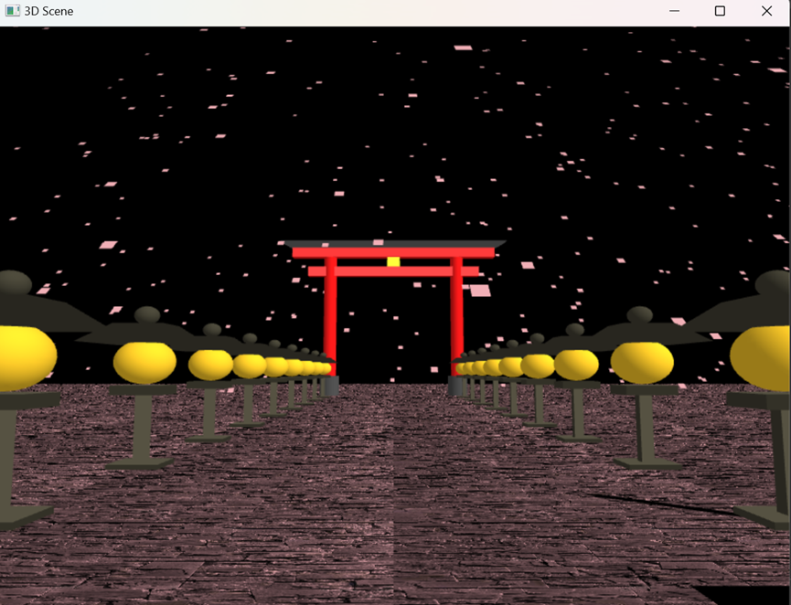

# OpenGL Animation Scene



Custom 3D Animation Pipeline implemented in modern C++ and OpenGL. The application renders an animated real-time walkthrough through a stylized Japanese garden scene with a textured ground plane, procedural Torii/Toro geometry, dynamic camera motion, projected shadows, and falling sakura petals.

## Technical Highlights

- CMake-based C++17 project layout with separated `src`, `include`, `assets`, `shaders`, and `third_party` directories.
- Fixed-function OpenGL rendering pipeline using FreeGLUT, GLU camera/projection utilities, and OpenGL material/light state.
- Procedural mesh construction for Torii gates, stone lanterns, cylinders, pyramids, ground quads, and particle billboards.
- Hierarchical matrix transformations with explicit `glPushMatrix`/`glPopMatrix` composition for reusable scene objects.
- Real-time camera walkthrough driven by elapsed-frame timing.
- Sakura particle simulation with randomized spawn positions, per-particle fall speed, wind drift, and reset behavior.
- Planar projected shadows generated from a custom 4x4 shadow matrix.
- Texture loading through `stb_image` with repeat-wrapped ground sampling.

## Repository Layout

```text
.
├── assets/                 # Runtime textures and future demo captures
├── include/                # Public/vendor headers
├── shaders/                # Reserved for GLSL programs in the programmable pipeline path
├── src/                    # C++ source files
├── third_party/freeglut/   # Bundled Windows FreeGLUT runtime/import library
├── CMakeLists.txt
└── README.md
```

## Dependencies

- CMake 3.20 or newer
- C++17 compiler
- OpenGL
- GLU
- FreeGLUT

On Windows, the repository includes a bundled FreeGLUT DLL/import library for convenience. On Linux, install the platform FreeGLUT and GLU development packages.

## How to Build

### Windows

```powershell
cmake -S . -B build -G "Visual Studio 17 2022" -A Win32
cmake --build build --config Release
.\build\Release\OpenGLAniScene.exe
```

The bundled FreeGLUT binary is 32-bit, so the command above intentionally selects the `Win32` platform. To build x64, install a 64-bit FreeGLUT package and configure with:

```powershell
cmake -S . -B build -G "Visual Studio 17 2022" -A x64 -DOPENGL_ANISCENE_USE_BUNDLED_FREEGLUT=OFF
```

### Linux

Install dependencies:

```bash
sudo apt update
sudo apt install cmake g++ freeglut3-dev libglu1-mesa-dev
```

Build and run:

```bash
cmake -S . -B build -DCMAKE_BUILD_TYPE=Release
cmake --build build
./build/OpenGLAniScene
```

## Runtime Assets

CMake copies the `assets` directory next to the executable after every build. The current scene uses `assets/stone_texture.jpg` for the tiled ground material.

## Roadmap

- Migrate fixed-function rendering to a programmable OpenGL shader pipeline.
- Introduce explicit VBO/VAO mesh buffers for procedural geometry.
- Add camera controls and configurable animation playback.
- Capture and commit `assets/demo.gif` for the GitHub project preview.
